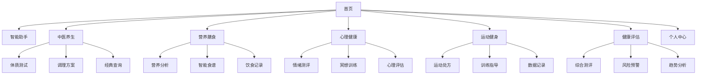

## 1. 产品概述

大健康养生专家智能Agent系统是一个基于人工智能技术的专业健康管理平台，集成中医养生、营养膳食、心理健康、运动健身等多维度健康服务。系统通过智能分析用户的体质特征、生活习惯和健康数据，为用户提供个性化、科学化的健康养生方案。

产品目标用户包括注重健康养生的中高端人群、亚健康状态人群、慢性病患者以及健康管理机构。通过AI技术让传统养生智慧与现代科学相结合，为用户提供7x24小时的专业健康顾问服务。

## 2. 核心功能

### 2.1 用户角色

| 角色 | 注册方式 | 核心权限 |
|------|----------|----------|
| 普通用户 | 手机号/邮箱注册 | 基础健康评估、养生建议查询、个人健康档案管理 |
| 高级会员 | 付费升级 | AI专家咨询、个性化方案定制、专业报告生成、优先客服支持 |
| 健康管理师 | 资质认证 | 用户健康档案管理、专业建议发布、数据分析报告 |
| 系统管理员 | 后台创建 | 系统配置、用户管理、内容审核、数据监控 |

### 2.2 功能模块

系统包含以下核心功能模块：

1. **中医养生调理模块**：体质辨识、个性化调理方案、中药建议、穴位按摩指导
2. **食物营养搭配模块**：营养分析、智能食谱推荐、食材相克提醒、节气养生
3. **情绪心理健康模块**：情绪识别、冥想训练、心理健康评估、专业建议
4. **运动健康管理模块**：运动处方、训练计划、数据追踪、效果评估
5. **综合健康评估模块**：多维度评估、健康报告、风险预警、趋势分析
6. **智能问答助手模块**：自然语言交互、专业知识问答、个性化建议
7. **个人健康档案模块**：数据记录、历史追踪、隐私设置、数据导出

### 2.3 页面详情

| 页面名称 | 模块名称 | 功能描述 |
|----------|----------|----------|
| 首页 | 智能助手入口 | 快速进入AI对话界面，支持语音和文字输入，展示个性化健康提醒 |
| 首页 | 功能导航 | 中医养生、营养膳食、心理健康、运动健身四大核心模块入口 |
| 首页 | 健康概览 | 显示今日健康评分、睡眠质量、运动数据、饮食记录等关键指标 |
| 首页 | 推荐内容 | 基于用户画像的个性化养生文章、视频、食谱推荐 |
| 中医养生 | 体质测试 | 通过问卷、舌象上传、症状选择等方式进行中医体质辨识 |
| 中医养生 | 体质报告 | 显示体质类型分析、特征描述、易患疾病、调理原则 |
| 中医养生 | 调理方案 | 提供中药方剂、穴位按摩、食疗建议、生活起居指导 |
| 中医养生 | 经典查询 | 《黄帝内经》等中医经典的智能检索和内容推荐 |
| 营养膳食 | 营养分析 | 上传食物照片或输入食材，自动分析营养成分和热量 |
| 营养膳食 | 智能食谱 | 根据体质、季节、健康状况推荐个性化食谱和制作方法 |
| 营养膳食 | 饮食记录 | 记录每日饮食，追踪营养摄入，生成营养报告 |
| 营养膳食 | 食材库 | 完整的食材营养成分数据库，支持搜索和筛选 |
| 心理健康 | 情绪测评 | 通过文字、语音分析识别情绪状态和心理压力 |
| 心理健康 | 冥想训练 | 提供正念冥想、呼吸训练、放松练习等音频指导 |
| 心理健康 | 心理评估 | 专业心理量表测试，生成心理健康报告 |
| 心理健康 | 心理知识 | 心理健康科普文章、视频，涵盖焦虑、抑郁、压力管理等 |
| 运动健身 | 运动处方 | 根据年龄、体质、健康状况制定个性化运动计划 |
| 运动健身 | 训练指导 | 提供太极拳、八段锦、有氧运动等视频教学和动作指导 |
| 运动健身 | 数据记录 | 记录运动时长、强度、心率等数据，生成运动报告 |
| 运动健身 | 效果评估 | 分析运动效果，动态调整训练计划 |
| 健康评估 | 综合测评 | 整合多维度数据，生成全面健康评估报告 |
| 健康评估 | 风险预警 | 基于数据分析识别潜在健康风险，提供预防建议 |
| 健康评估 | 趋势分析 | 展示健康指标变化趋势，预测健康发展方向 |
| 个人中心 | 健康档案 | 管理个人基本信息、健康数据、体检报告等 |
| 个人中心 | 隐私设置 | 控制数据共享范围，设置数据可见性和使用权限 |
| 个人中心 | 会员中心 | 会员权益展示、续费管理、专属服务入口 |

## 3. 核心流程

### 3.1 新用户注册流程
用户首次使用系统时，需要完成基础信息录入和初步健康评估：

1. 用户通过手机号或邮箱注册账号
2. 填写基础个人信息（年龄、性别、身高、体重等）
3. 完成中医体质辨识问卷
4. 选择健康目标（改善亚健康、慢性病调理、体质增强等）
5. 系统生成个性化健康档案和初始建议

### 3.2 AI智能咨询流程
用户可以通过对话方式获取健康建议：

1. 用户通过文字或语音输入健康问题
2. 系统进行自然语言理解，识别用户意图
3. 调用相应的知识库和分析模型
4. 生成个性化的健康建议方案
5. 以图文、语音等形式呈现给用户

### 3.3 健康数据管理流程
系统持续收集和分析用户健康数据：

1. 用户主动录入或通过设备同步健康数据
2. 系统进行数据清洗和质量验证
3. 基于AI模型进行数据分析和趋势预测
4. 生成健康报告和风险预警
5. 调整个性化健康方案

### 页面导航流程

## 4. 用户界面设计

### 4.1 设计风格

- **色彩方案**：以绿色为主色调，象征生命与健康；搭配白色和浅灰色，营造清新自然的视觉效果
- **按钮样式**：采用圆角矩形设计，悬停时有轻微阴影效果，增强交互感
- **字体选择**：中文使用思源黑体，英文使用Roboto，确保跨平台显示一致性
- **布局风格**：卡片式布局为主，信息层次清晰；采用响应式设计适配不同设备
- **图标风格**：使用线性图标，简洁现代；健康相关图标采用拟物化设计增强识别度

### 4.2 页面设计概述

| 页面名称 | 模块名称 | UI元素设计 |
|----------|----------|------------|
| 首页 | 顶部导航栏 | 绿色渐变背景，包含logo、搜索框、用户头像；固定定位，滚动时保持可见 |
| 首页 | 智能助手入口 | 圆形悬浮按钮，绿色背景配白色麦克风图标；点击展开对话界面 |
| 首页 | 功能模块卡片 | 四大模块采用不同颜色区分，圆角卡片设计，包含图标和简短描述 |
| 首页 | 健康概览面板 | 数据可视化图表展示关键指标，支持点击查看详情 |
| 中医养生 | 体质测试界面 | 步骤进度条显示，问题采用卡片式布局，支持图片上传功能 |
| 中医养生 | 体质报告 | 雷达图展示体质特征，配以文字说明和建议 |
| 营养膳食 | 食物识别 | 支持拍照上传和手动输入两种方式，实时显示营养分析结果 |
| 营养膳食 | 食谱推荐 | 瀑布流布局展示食谱卡片，包含图片、营养评分、制作难度 |
| 心理健康 | 情绪测评 | 简洁的问卷界面，支持语音输入，实时显示情绪分析结果 |
| 心理健康 | 冥想播放 | 音频播放器界面，包含进度条、音量控制、定时功能 |
| 运动健身 | 训练视频 | 全屏播放界面，支持暂停、重播、倍速播放，显示动作要点 |
| 运动健身 | 数据记录 | 图表展示运动数据趋势，支持日、周、月不同时间维度 |
| 健康评估 | 综合报告 | 多维度评分展示，风险预警采用颜色编码，支持PDF导出 |

### 4.3 响应式设计

系统采用桌面优先的设计策略，确保在PC端提供最佳的用户体验：

- **桌面端**（1200px以上）：多栏布局，充分利用屏幕空间展示详细信息
- **平板端**（768px-1199px）：双栏布局，保持核心功能完整性
- **手机端**（767px以下）：单栏布局，重点突出核心功能，简化操作流程

触控交互优化：按钮和可点击区域最小尺寸为44px，支持手势操作，提供触觉反馈。

### 4.4 数据可视化设计

健康数据采用多种图表形式展示：

- **折线图**：展示健康指标的时间趋势变化
- **雷达图**：多维度体质特征和能力评估
- **饼图**：营养成分占比和饮食结构分析
- **柱状图**：运动数据对比和目标完成情况
- **仪表盘**：综合健康评分和风险等级显示

图表采用温和的配色方案，支持交互式操作，用户可以点击查看详细数据和趋势分析。