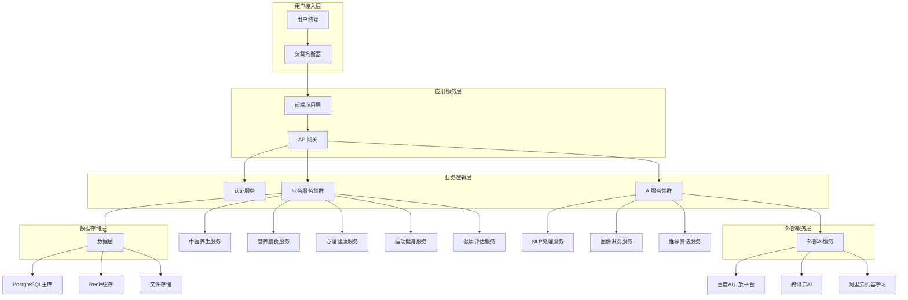
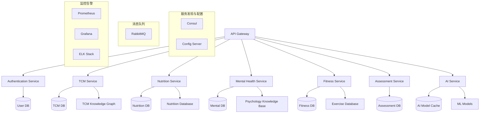
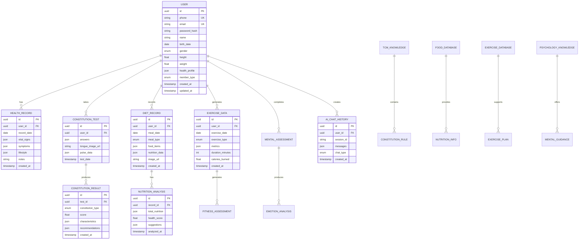

## 1. 架构设计

系统采用微服务架构，前端基于React构建，后端使用Node.js + Express，数据库采用PostgreSQL，通过Docker容器化部署。核心AI功能通过集成第三方AI服务和自研算法实现。



## 2. 技术描述

### 2.1 核心技术栈

- **前端**: React@18 + TypeScript + Ant Design + Tailwind CSS
- **状态管理**: Redux Toolkit + RTK Query
- **构建工具**: Vite
- **移动端**: React Native（后续扩展）
- **后端**: Node.js@18 + Express@4 + TypeScript
- **数据库**: PostgreSQL@14 + Redis@7
- **AI/ML**: Python@3.9 + TensorFlow@2.8 + PyTorch@1.12
- **容器化**: Docker + Docker Compose
- **监控**: Prometheus + Grafana
- **日志**: ELK Stack (Elasticsearch + Logstash + Kibana)

### 2.2 关键依赖库

```json
{
  "dependencies": {
    "@reduxjs/toolkit": "^1.9.0",
    "react": "^18.2.0",
    "react-dom": "^18.2.0",
    "antd": "^5.0.0",
    "tailwindcss": "^3.2.0",
    "axios": "^1.2.0",
    "react-router-dom": "^6.4.0",
    "recharts": "^2.5.0",
    "react-query": "^3.39.0",
    "express": "^4.18.0",
    "pg": "^8.8.0",
    "redis": "^4.5.0",
    "jsonwebtoken": "^9.0.0",
    "bcryptjs": "^2.4.3",
    "multer": "^1.4.5",
    "socket.io": "^4.5.0",
    "tensorflow": "^2.8.0",
    "transformers": "^4.21.0",
    "opencv-python": "^4.6.0"
  }
}
```

## 3. 路由定义

### 3.1 前端路由

| 路由路径 | 页面组件 | 功能描述 |
|----------|----------|----------|
| / | HomePage | 系统首页，展示核心功能入口 |
| /login | LoginPage | 用户登录页面 |
| /register | RegisterPage | 用户注册页面 |
| /dashboard | DashboardPage | 个人健康仪表板 |
| /tcm | TCMPage | 中医养生模块主页 |
| /tcm/constitution | ConstitutionTest | 体质测试页面 |
| /tcm/report | ConstitutionReport | 体质报告页面 |
| /nutrition | NutritionPage | 营养膳食模块主页 |
| /nutrition/analyze | NutritionAnalyze | 营养分析页面 |
| /nutrition/recipes | RecipeRecommendation | 食谱推荐页面 |
| /mental | MentalHealthPage | 心理健康模块主页 |
| /mental/assessment | MentalAssessment | 心理评估页面 |
| /mental/meditation | MeditationPage | 冥想训练页面 |
| /fitness | FitnessPage | 运动健身模块主页 |
| /fitness/plan | FitnessPlan | 运动计划页面 |
| /fitness/tracking | FitnessTracking | 运动追踪页面 |
| /assessment | HealthAssessmentPage | 健康评估主页 |
| /assessment/report | HealthReport | 健康报告页面 |
| /profile | ProfilePage | 个人中心页面 |
| /profile/health-record | HealthRecord | 健康档案管理 |
| /ai-assistant | AIAssistantPage | AI智能助手页面 |

### 3.2 API路由

| 路由路径 | 请求方法 | 功能描述 |
|----------|----------|----------|
| /api/auth/login | POST | 用户登录认证 |
| /api/auth/register | POST | 用户注册 |
| /api/auth/refresh | POST | Token刷新 |
| /api/user/profile | GET/PUT | 用户信息管理 |
| /api/tcm/constitution | POST | 体质测试提交 |
| /api/tcm/analysis | GET | 体质分析报告 |
| /api/nutrition/analyze | POST | 营养分析 |
| /api/nutrition/recipes | GET | 食谱推荐 |
| /api/mental/assessment | POST | 心理评估 |
| /api/mental/meditation | GET | 冥想内容获取 |
| /api/fitness/plan | GET/POST | 运动计划管理 |
| /api/fitness/tracking | POST | 运动数据记录 |
| /api/assessment/comprehensive | GET | 综合健康评估 |
| /api/ai/chat | POST | AI对话接口 |
| /api/upload/image | POST | 图片上传接口 |
| /api/upload/voice | POST | 语音上传接口 |

## 4. API定义

### 4.1 认证相关API

#### 用户登录
```
POST /api/auth/login
```

请求参数：
| 参数名 | 类型 | 必需 | 描述 |
|--------|------|------|------|
| phone | string | 是 | 手机号 |
| password | string | 是 | 密码（MD5加密） |
| captcha | string | 是 | 验证码 |

响应数据：
```json
{
  "code": 200,
  "message": "登录成功",
  "data": {
    "token": "eyJhbGciOiJIUzI1NiIsInR5cCI6IkpXVCJ9...",
    "refreshToken": "eyJhbGciOiJIUzI1NiIsInR5cCI6IkpXVCJ9...",
    "userInfo": {
      "id": "123456",
      "name": "张三",
      "avatar": "https://example.com/avatar.jpg",
      "memberType": "premium",
      "expiredAt": "2024-12-31"
    }
  }
}
```

### 4.2 中医养生API

#### 体质测试提交
```
POST /api/tcm/constitution
```

请求参数：
```json
{
  "answers": [
    {"questionId": 1, "answer": "A"},
    {"questionId": 2, "answer": "B"}
  ],
  "tongueImage": "base64 encoded image",
  "pulseData": {
    "rate": 72,
    "rhythm": "regular",
    "strength": "moderate"
  }
}
```

响应数据：
```json
{
  "code": 200,
  "data": {
    "constitutionType": "qi_deficiency",
    "score": 85,
    "characteristics": ["容易疲劳", "声音低弱", "气短懒言"],
    "recommendations": {
      "diet": "宜食补气食物，如山药、红枣",
      "lifestyle": "规律作息，适度运动",
      "herbs": "黄芪、党参等补气药材"
    }
  }
}
```

### 4.3 营养膳食API

#### 营养分析
```
POST /api/nutrition/analyze
```

请求参数：
```json
{
  "image": "base64 encoded food image",
  "foodName": "番茄炒蛋",
  "weight": 200
}
```

响应数据：
```json
{
  "code": 200,
  "data": {
    "foodItems": [
      {
        "name": "番茄",
        "weight": 100,
        "calories": 18,
        "protein": 0.9,
        "fat": 0.2,
        "carbs": 3.9,
        "fiber": 1.2
      }
    ],
    "totalNutrition": {
      "calories": 180,
      "protein": 12.5,
      "fat": 8.3,
      "carbs": 15.2
    },
    "healthScore": 85,
    "suggestions": ["蛋白质搭配合理", "建议增加蔬菜摄入"]
  }
}
```

### 4.4 心理健康API

#### 情绪识别
```
POST /api/mental/emotion-recognition
```

请求参数：
```json
{
  "text": "最近工作压力很大，总是感到焦虑不安",
  "voiceData": "base64 encoded audio",
  "context": {
    "time": "2024-01-15 14:30",
    "location": "办公室",
    "activity": "工作"
  }
}
```

响应数据：
```json
{
  "code": 200,
  "data": {
    "emotion": "anxiety",
    "confidence": 0.87,
    "intensity": "moderate",
    "factors": ["工作压力", "时间紧迫", "睡眠质量"],
    "recommendations": {
      "immediate": "深呼吸练习，短暂休息",
      "longTerm": "时间管理，运动调节",
      "resources": ["冥想音频", "心理咨询"]
    }
  }
}
```

### 4.5 AI助手API

#### 智能对话
```
POST /api/ai/chat
```

请求参数：
```json
{
  "message": "我最近总是感觉疲劳，有什么养生建议吗？",
  "context": {
    "userId": "123456",
    "sessionId": "session_001",
    "history": [
      {"role": "user", "content": "你好"},
      {"role": "assistant", "content": "您好！我是您的健康助手"}
    ]
  },
  "type": "text"
}
```

响应数据：
```json
{
  "code": 200,
  "data": {
    "response": "根据您的描述，疲劳可能与多种因素有关。建议您：1.检查睡眠质量...",
    "confidence": 0.92,
    "category": "health_consultation",
    "suggestions": [
      "建议进行体质测试",
      "保持规律作息",
      "适度运动锻炼"
    ],
    "relatedQuestions": [
      "如何改善睡眠质量？",
      "哪些食物有助于缓解疲劳？"
    ]
  }
}
```

## 5. 服务器架构

### 5.1 微服务架构



### 5.2 服务详细设计

#### 认证服务 (Authentication Service)
- **技术栈**: Node.js + Express + JWT + Redis
- **功能**: 用户认证、权限管理、Token管理、会话控制
- **数据库**: PostgreSQL (用户信息) + Redis (会话缓存)

#### 中医养生服务 (TCM Service)
- **技术栈**: Python + Flask + TensorFlow
- **功能**: 体质辨识、中医知识图谱、经典文献检索
- **AI模型**: BERT中文预训练模型 + 自定义分类模型
- **数据库**: PostgreSQL + Neo4j (知识图谱)

#### 营养膳食服务 (Nutrition Service)
- **技术栈**: Node.js + Express + OpenCV
- **功能**: 食物识别、营养分析、食谱推荐
- **AI模型**: ResNet50 (图像识别) + 推荐算法
- **数据库**: PostgreSQL + MongoDB (食谱数据)

#### 心理健康服务 (Mental Health Service)
- **技术栈**: Python + FastAPI + Transformers
- **功能**: 情绪识别、心理评估、冥想内容管理
- **AI模型**: BERT情感分析 + 语音情感识别
- **数据库**: PostgreSQL

#### 运动健身服务 (Fitness Service)
- **技术栈**: Node.js + Express
- **功能**: 运动计划、数据追踪、效果评估
- **数据库**: PostgreSQL + Redis (缓存)

#### AI服务 (AI Service)
- **技术栈**: Python + FastAPI + PyTorch
- **功能**: 自然语言处理、智能问答、知识推理
- **AI模型**: ChatGLM + 知识图谱嵌入
- **外部API**: 百度文心一言、阿里通义千问

## 6. 数据模型

### 6.1 数据库设计



### 6.2 数据定义语言

#### 用户表 (users)
```sql
-- 创建用户表
CREATE TABLE users (
    id UUID PRIMARY KEY DEFAULT gen_random_uuid(),
    phone VARCHAR(20) UNIQUE NOT NULL,
    email VARCHAR(255) UNIQUE,
    password_hash VARCHAR(255) NOT NULL,
    name VARCHAR(100) NOT NULL,
    birth_date DATE,
    gender VARCHAR(10) CHECK (gender IN ('male', 'female', 'other')),
    height FLOAT CHECK (height > 0 AND height < 300),
    weight FLOAT CHECK (weight > 0 AND weight < 500),
    health_profile JSONB DEFAULT '{}',
    member_type VARCHAR(20) DEFAULT 'free' CHECK (member_type IN ('free', 'premium', 'professional')),
    is_active BOOLEAN DEFAULT true,
    created_at TIMESTAMP WITH TIME ZONE DEFAULT NOW(),
    updated_at TIMESTAMP WITH TIME ZONE DEFAULT NOW()
);

-- 创建索引
CREATE INDEX idx_users_phone ON users(phone);
CREATE INDEX idx_users_email ON users(email);
CREATE INDEX idx_users_member_type ON users(member_type);

-- 创建更新时间触发器
CREATE OR REPLACE FUNCTION update_updated_at_column()
RETURNS TRIGGER AS $$
BEGIN
    NEW.updated_at = NOW();
    RETURN NEW;
END;
$$ language 'plpgsql';

CREATE TRIGGER update_users_updated_at 
    BEFORE UPDATE ON users 
    FOR EACH ROW 
    EXECUTE FUNCTION update_updated_at_column();
```

#### 中医体质测试结果表 (constitution_results)
```sql
-- 创建体质测试结果表
CREATE TABLE constitution_results (
    id UUID PRIMARY KEY DEFAULT gen_random_uuid(),
    user_id UUID NOT NULL REFERENCES users(id) ON DELETE CASCADE,
    test_id UUID NOT NULL,
    constitution_type VARCHAR(50) NOT NULL,
    score FLOAT CHECK (score >= 0 AND score <= 100),
    characteristics JSONB DEFAULT '[]',
    recommendations JSONB DEFAULT '{}',
    created_at TIMESTAMP WITH TIME ZONE DEFAULT NOW(),
    UNIQUE(user_id, test_id)
);

-- 创建索引
CREATE INDEX idx_constitution_results_user_id ON constitution_results(user_id);
CREATE INDEX idx_constitution_results_constitution_type ON constitution_results(constitution_type);
CREATE INDEX idx_constitution_results_created_at ON constitution_results(created_at DESC);
```

#### 饮食记录表 (diet_records)
```sql
-- 创建饮食记录表
CREATE TABLE diet_records (
    id UUID PRIMARY KEY DEFAULT gen_random_uuid(),
    user_id UUID NOT NULL REFERENCES users(id) ON DELETE CASCADE,
    meal_date DATE NOT NULL,
    meal_type VARCHAR(20) CHECK (meal_type IN ('breakfast', 'lunch', 'dinner', 'snack')),
    food_items JSONB NOT NULL DEFAULT '[]',
    nutrition_data JSONB DEFAULT '{}',
    image_url VARCHAR(500),
    health_score FLOAT CHECK (health_score >= 0 AND health_score <= 100),
    created_at TIMESTAMP WITH TIME ZONE DEFAULT NOW()
);

-- 创建索引
CREATE INDEX idx_diet_records_user_id ON diet_records(user_id);
CREATE INDEX idx_diet_records_meal_date ON diet_records(meal_date);
CREATE INDEX idx_diet_records_meal_type ON diet_records(meal_type);
```

#### 运动数据表 (exercise_data)
```sql
-- 创建运动数据表
CREATE TABLE exercise_data (
    id UUID PRIMARY KEY DEFAULT gen_random_uuid(),
    user_id UUID NOT NULL REFERENCES users(id) ON DELETE CASCADE,
    exercise_date DATE NOT NULL,
    exercise_type VARCHAR(100) NOT NULL,
    duration_minutes INTEGER CHECK (duration_minutes > 0),
    calories_burned FLOAT CHECK (calories_burned >= 0),
    metrics JSONB DEFAULT '{}',
    heart_rate_avg INTEGER,
    heart_rate_max INTEGER,
    created_at TIMESTAMP WITH TIME ZONE DEFAULT NOW()
);

-- 创建索引
CREATE INDEX idx_exercise_data_user_id ON exercise_data(user_id);
CREATE INDEX idx_exercise_data_exercise_date ON exercise_data(exercise_date);
CREATE INDEX idx_exercise_data_exercise_type ON exercise_data(exercise_type);
```

#### AI对话历史表 (ai_chat_history)
```sql
-- 创建AI对话历史表
CREATE TABLE ai_chat_history (
    id UUID PRIMARY KEY DEFAULT gen_random_uuid(),
    user_id UUID NOT NULL REFERENCES users(id) ON DELETE CASCADE,
    session_id VARCHAR(100) NOT NULL,
    messages JSONB NOT NULL DEFAULT '[]',
    chat_type VARCHAR(50) DEFAULT 'health_consultation',
    ai_model VARCHAR(100),
    response_time_ms INTEGER,
    created_at TIMESTAMP WITH TIME ZONE DEFAULT NOW()
);

-- 创建索引
CREATE INDEX idx_ai_chat_user_id ON ai_chat_history(user_id);
CREATE INDEX idx_ai_chat_session_id ON ai_chat_history(session_id);
CREATE INDEX idx_ai_chat_created_at ON ai_chat_history(created_at DESC);
```

### 6.3 权限配置

```sql
-- 为匿名用户授予基本读取权限
GRANT SELECT ON users TO anon;
GRANT SELECT ON constitution_results TO anon;
GRANT SELECT ON diet_records TO anon;

-- 为认证用户授予完整权限
GRANT ALL PRIVILEGES ON users TO authenticated;
GRANT ALL PRIVILEGES ON constitution_results TO authenticated;
GRANT ALL PRIVILEGES ON diet_records TO authenticated;
GRANT ALL PRIVILEGES ON exercise_data TO authenticated;
GRANT ALL PRIVILEGES ON ai_chat_history TO authenticated;

-- 创建行级安全策略
ALTER TABLE users ENABLE ROW LEVEL SECURITY;
ALTER TABLE constitution_results ENABLE ROW LEVEL SECURITY;
ALTER TABLE diet_records ENABLE ROW LEVEL SECURITY;

-- 用户只能查看和修改自己的数据
CREATE POLICY users_policy ON users
    FOR ALL TO authenticated
    USING (auth.uid() = id);

CREATE POLICY constitution_results_policy ON constitution_results
    FOR ALL TO authenticated
    USING (auth.uid() = user_id);

CREATE POLICY diet_records_policy ON diet_records
    FOR ALL TO authenticated
    USING (auth.uid() = user_id);
```

## 7. 安全与隐私设计

### 7.1 数据加密

- **传输加密**: 全站HTTPS，TLS 1.3
- **存储加密**: 敏感数据AES-256加密
- **密码安全**: bcrypt加盐哈希，工作因子12
- **API安全**: JWT Token + Refresh Token机制

### 7.2 隐私保护

- **数据最小化**: 只收集必要的健康数据
- **用户控制**: 用户可查看、导出、删除个人数据
- **匿名化处理**: 数据分析时使用脱敏数据
- **合规性**: 符合GDPR、网络安全法、数据安全法

### 7.3 安全监控

- **访问日志**: 记录所有API调用和敏感操作
- **异常检测**: AI驱动的异常行为识别
- **数据备份**: 每日增量备份，7天完整备份
- **灾难恢复**: RPO < 1小时，RTO < 4小时